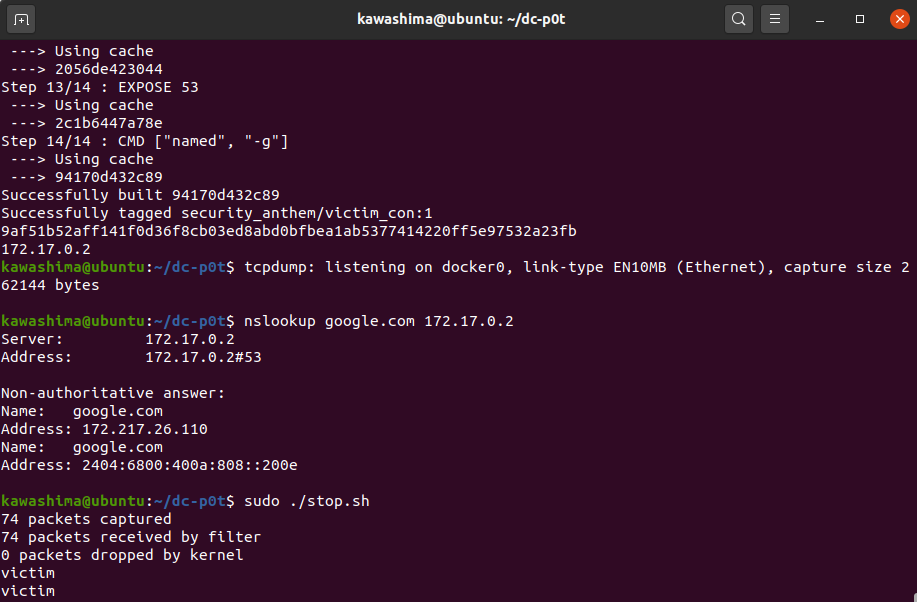
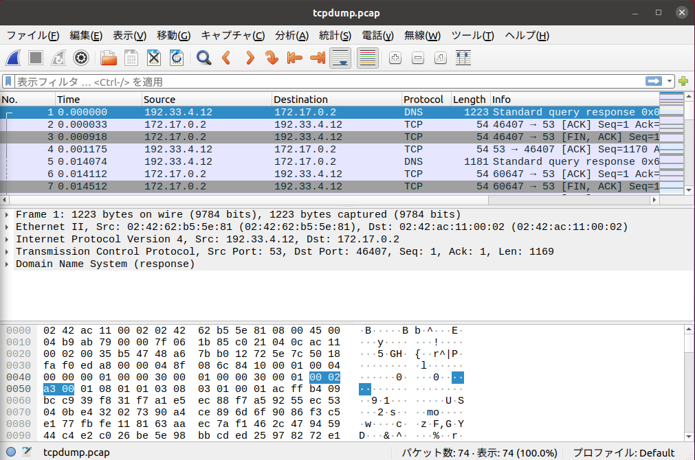
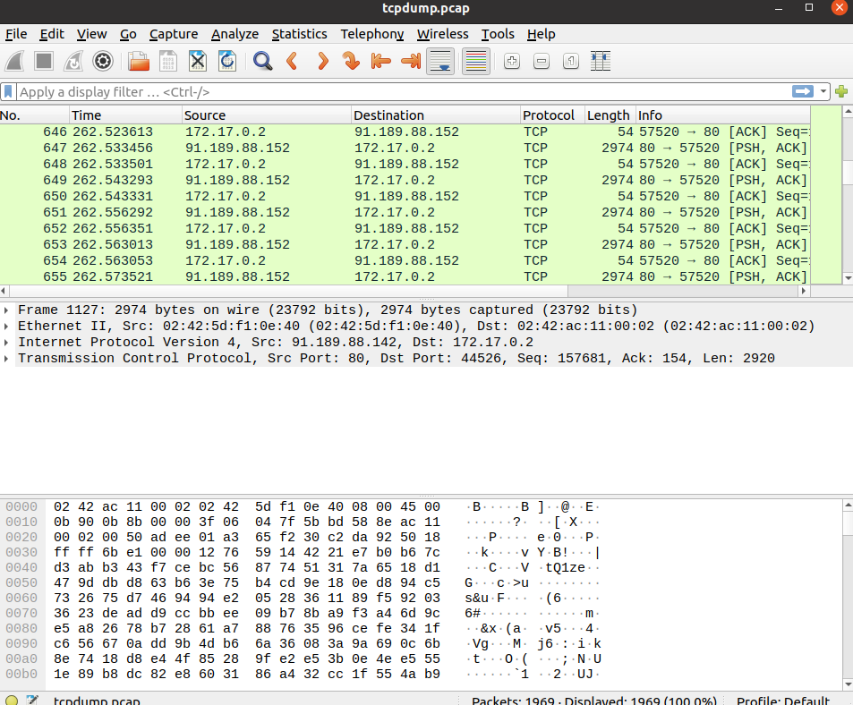

DC-p0t (Hurry Potter)
=============
DC-p0tは，攻撃環境を再現する高対話型のハニーポットです．
Docker上にWebサーバまたはDNSサーバを立ち上げ，tcpdumpを用いて通信を監視します．
また，通信ログの可視化も同時に行います．

<!--
## Description
-->
## 利用例
Docker上でbind9を立ち上げた状態で，google.comのDNSを問い合わせた際の端末およびWiresharkの画面


Wiresharkでtcpdump.pcapを開いた画面


[CVE-2011-3192を利用したexploit code](https://gist.github.com/dcarley/1170447)を用いたDoS攻撃の結果


## VS.
 　既存のハニーポットとして，T-pot，Linuxコンテナ技術を利用したSHHハニーポット，BW-Potが挙げられる．

　T-potはDockerを利用した低対話型ハニーポット統合管理OSの名称である．既存のハニーポットと，IDSを利用できるツールを組み合わせて，各ハニーポットのログを統合管理している．様々なハニーポットをDocker上で動かしログを収集できるが，運用するにはT-pot提供元から配布されるOSディスクイメージを利用する必要があるため，短時間で容易に環境を構築できるとは言い難い．

Linuxコンテナ技術を利用したSHHハニーポットは，攻撃者が実行できるアクションが実際のLinuxシステムとほとんど同等である高対話型の側面を持つとともに，OSレベル仮想化によるホストからのファイルシステムの隔離と，オーバヘッドの少ないコンテナの生成，破棄が可能である低対話型の側面を持つハニーポットである．このハニーポットでは，実際のLinuxシステムで提供されているコマンドを扱うことができるため，実環境に近い状態のサーバを用いることができる．一方で，ログの収集方法については，コマンドの履歴やファイルの抽出など，一般的なハニーポットと同様の機能しか有していないため，具体的な攻撃内容を知ることは難しい．

BW-Potは，HTTPまたはHTTPSを対象とした高対話型ハニーポットである．侵害されやすいwebアプリケーションを構築することで，攻撃者からのアクセス観察することができる．しかし，収集したログから，攻撃によって何が起きたのか判断するのが難しい．

## 動作確認した環境
|||
----|----
|ホストOS      |Windows 10 Pro       |
|VMM           | Oracle VM VirtualBox|
|ゲストOS      |Ubuntu 20.04.1       |

Windows 10 で，[Oracle VM VirtualBox](https://www.virtualbox.org/)をインストールし，
VirtualBox上に[Ubuntu](https://jp.ubuntu.com/download)をインストールした環境を用意する．

## インストール方法
1. BPF toolsのインストール
```
sudo apt -y install bpfcc-tools
```

2. Dockerのインストール
参考URL: https://docs.docker.com/engine/install/ubuntu/

```
sudo apt-get remove docker docker-engine docker.io containerd runc
sudo apt-get install \
    apt-transport-https \
    ca-certificates \
    curl \
    gnupg-agent \
    software-properties-common
curl -fsSL https://download.docker.com/linux/ubuntu/gpg | sudo apt-key add -
sudo add-apt-repository \
   "deb [arch=amd64] https://download.docker.com/linux/ubuntu \
   $(lsb_release -cs) \
   stable"
sudo apt update
sudo apt-get install docker-ce docker-ce-cli containerd.io
```
ディスク容量について聞かれた場合，「Y」を入力する．

## 使い方
1. インストール方法を参考に，環境構築を行う．

2. 設定ファイルの修正

    setup/init.jsonを以下のように修正する．
~~~json
{
    "app":"apache", 
    "app_version": "2.4.7"
}
~~~

appには，インストール対象のプログラムの名前，app_versionにversionの記号を入力する．

- init.jsonの記述例を以下のファイルに記述している．これらを写しても良い．

|サービス名|ファイル名|
-----|------
|bind9|setup/sample/init_bind9_sample.json|
|Apache HTTP Server|setup/sample/init_apache_sample.json|
|php|setup/sample/init_php_sample.json|


現在，利用可能なプログラムは，以下の通り
```
apache2
apache2 + php
bind9
```

apache2のバージョン名は，以下のURLで取得できるバージョン名を指定する．

https://archive.apache.org/dist/httpd/

phpのバージョン名は，以下のURLで取得できるバージョン名を指定する．

https://www.php.net/distributions/

bind9のバージョン名は，以下のURLのリポジトリのタグ名を指定する．

https://gitlab.isc.org/isc-projects/bind9

3. 実行
```
./start.sh
```

dockerのWebサーバにhttp://localhost:8080 でアクセスできる。

4. 終了
```
./stop.sh
```

5. ログの確認

これで，tcpdump.pcapをwiresharkなどで開けば通信ログを確認できる。
<!--また、エラーがあれば`docker logs container_id`でlogを見ることができる。-->
また，docker_diff_result.txtに変更があったディレクトリやファイルの一覧が保存される．
さらに，docker_logに変更のあったファイルが保存される．

|ログの内容|ファイル名|収集方法|
-----------|----------|---------
|Dockerが関わる通信トラフィックのログ|log/packet/tcpdump.pcap| tcpdumpでdocker0をキャプチャ|
|コンテナで起動したプロセスのPIDとプロセス名|log/ps_monitor.log|execveシステムコールをホストでフックすることでプロセスの生成を監視|
|コンテナ起動中に追加や修正されたファイルの一覧|log/docker_diff_result.log|コンテナ停止直前にdocker diffで取得|
|コンテナ起動中に追加や修正されたファイル|log/docker_log/*|docker diffで取得したファイルをdocker cp で取得|
|コンテナ起動中に出力された標準出力および標準エラー出力|log/docker_logs_result.log|コンテナ停止直前にdocker logsで取得|

<!--
## Contribution
開発に関わる人は，を見てください．
-->

## License
MWS Cupの規定がある場合は，MWS Cupの規定に従う．
規定が無ければMIT Licenseを適用する．

## Author
MWS Cup 2020 セキュリティ讃歌


<!--
### 準備
Pythonのライブラリをインストールする．素のPythonを使う方法とPythonの仮想環境を使う方法がある．

####  素のPythonを使う場合
素のPythonを使う場合は以下を実行する．
```
$ pip3 install -r requirements.txt
```

####  Pythonの仮想環境機能を使う場合

Pythonの仮想環境を利用する場合は以下を実行する．
```
sudo apt install python3-venv
$ python3 -m venv venv
$ source venv/bin/activate
(venv) $ pip3 install -r requirements.txt
```

今後，仮想環境に入るには以下を実行する．
```
$ source venv/bin/activate
(venv) $
```

仮想環境から抜けるには以下を実行する．
```
(venv) $ deactivate
$
```

仮想環境を削除する場合は以下を実行する．
```
(venv) $ deactivate
$ rm -rf venv
```
